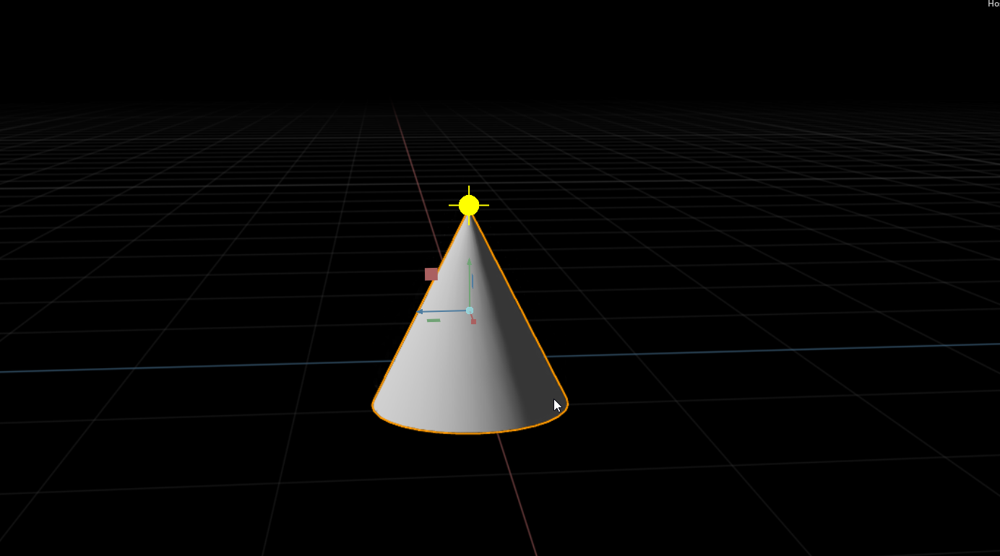

# Scene API Sample Extension

## Adding This Extension

To add a this extension to your Omniverse app:
1. Go into: Extension Manager -> Gear Icon -> Extension Search Path
2. Add this as a search path: `git://github.com/matiascodesal/scene-api-sample.git?branch=main&dir=exts`